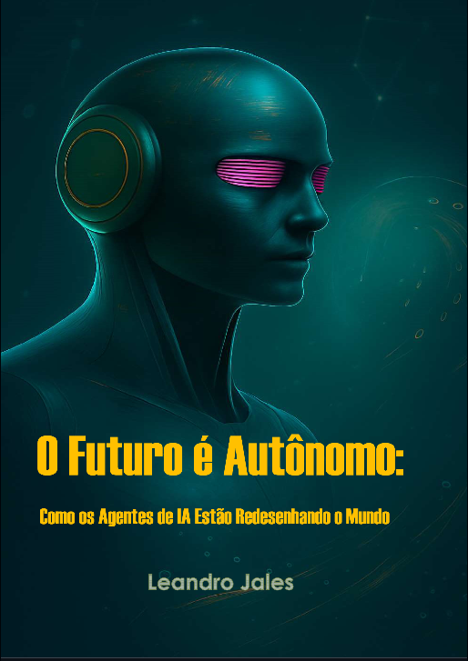

-------

# Projeto EBOOK Gerado por I.A.s

Projeto com o objetivo de gerar um ebook digital com as facilidades das ferramentas de IA. todos os prompts
seguem abaixo.

<a href="https://github.com/leandrojales2/prompts-recipe-to-create-a-ebook/blob/main/output/E-Book%20O%20Futuro%20%C3%A9%20Aut%C3%B4nomo%20-%20Como%20os%20Agentes%20de%20IA%20Est%C3%A3o%20Redesenhando%20o%20Mundo.pdf" title="View PDF now"> 📕Clique aqui para ler</a>

## 💻 Tecnologias utilizadas no projeto

- [ChatGPT](https://chat.openai.com/) 
- [Manus](https://manus.im/app)

## 🧠 Prompts

ChatGPT：

|   Ação    | prompt                                                                                                                                                                                                     |
| :------:  | -----------------------------------------------------------------------------------------------------------------------------------------------------------------------------------------------------------|
|  título   | Me de sugestões de títulos para e-books sobre agentes de IA                                                                                                                                                |
|  Sumário  | crie um sumário para o ebook O Futuro é Autônomo: Como os Agentes de IA Estão Redesenhando o Mundo                                                                                                         |
|  Conteúdo | gere os textos da parte I, com no mínimo 5.000 palavras por capitulo 1 mais acessível e didática; 2 capítulo por capítulo; 3 citações diretas/indiretas de fontes acadêmicas, artigos e notícias recentes; |

Manus：

|  Ação  | prompt                                                                                                      |
| :----: | ------------------------------------------------------------------------------------------------------------|
| Imagem | crie uma capa para e-book com o título O Futuro é Autônomo: Como os Agentes de IA Estão Redesenhando o Mundo|
| Imagem | Crie uma contracapa para este e-book                                                                        |

## ✨ Features

- Conteúdo gerado via ChatGPT
- Imagens geradas via Manus

## 📚 Materiais

- Imagens utilizadas em `assets`
- ebook gerado durante as aulas em `output`
